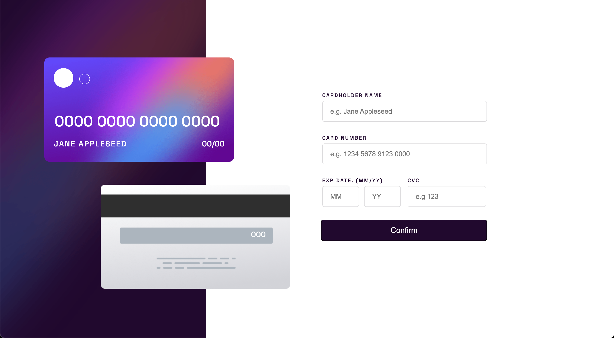
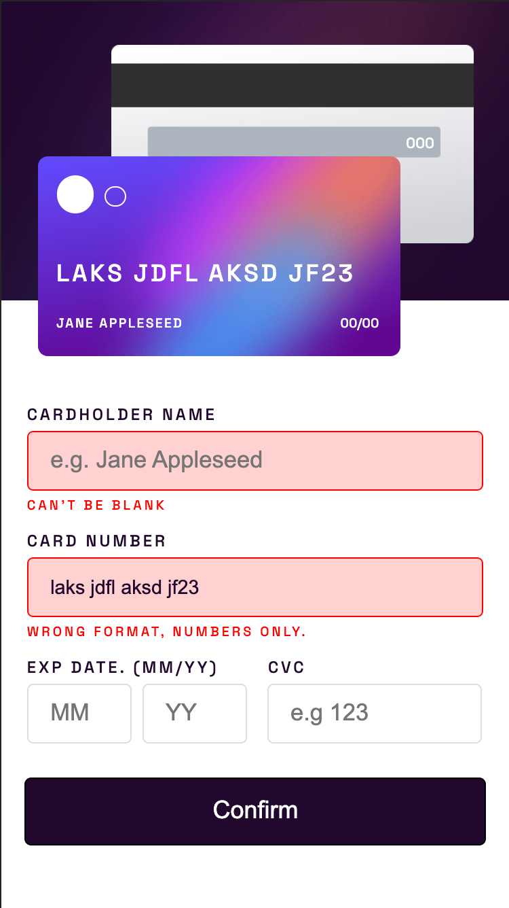
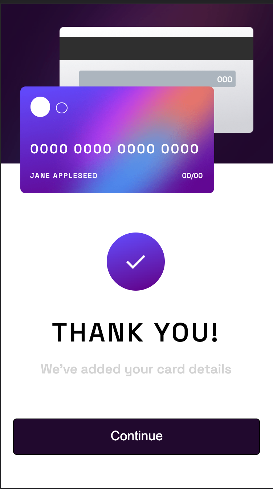

# Interactive Credit Card Form

## This app utilizes React.js in a single page app. 

## Features:
- Validation for each input field.
- Auto formatting for credit card input field.
- After subitting the form, the page will render a 'thank you' card and the text for the button will be changed to 'continue' in place of 'confirm'.
- The app has a mobile view that begins at 375px.

### Visuals:

  
  
   

